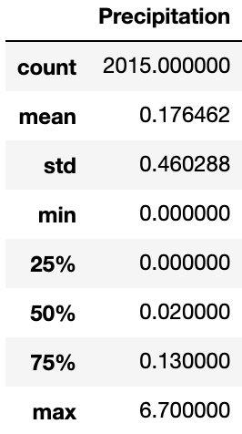

### Climate
#### <i> Climate analysis and exploration in Honolulu, HI</i>

----------------------

**Description:**

I used Python and SQL Alchemy to analyze the climate in Honolulu, HI and create a flask app for this analysis.

<b>Datasets used:</b>

* [Measurements](Resources/hawaii_measurements.csv)
* [Stations](Resources/hawaii_stations.csv)
* [SQL Database](Resources/hawaii.sqlite)

### Tools used:
----------------------

  - Python
  - Pandas
  - SQLAlchemy
  - Jupyter
  - Flask
  - Numpy

### Analysis:
----------------------

#### 12 Month Precipitation

#### Station Temperatures

###  Data Visualization:
----------------------

#### Active Stations

#### Precipitation Statistics

